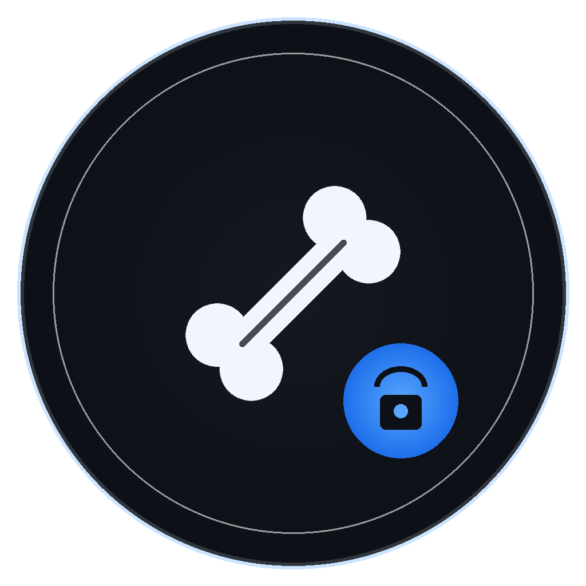

# Bone Browser

<p align="center">
  
</p>

<p align="center">
  <strong>Secure Tor Onion Browser</strong><br>
  Privacy-first browsing routed through the Tor network with AES-256 encrypted storage.
</p>

<p align="center">
  
  
  
  
  
</p>

---

## Features

### Security
- All traffic routed through Tor SOCKS5 proxy
- AES-256 encrypted bookmarks, config, and session data (Fernet + PBKDF2)
- Master password vault with PBKDF2-SHA256 (600,000 iterations)
- JavaScript disabled by default (toggle per-tab or globally)
- WebGL and canvas fingerprinting blocked
- Do Not Track header sent
- HTTPS-only mode for clearnet

### Privacy
- 40+ tracker/ad/analytics domains blocked at the network level
- Web font blocking option for reduced fingerprinting
- User agent randomization (Tor Browser UA pool)
- No persistent cookies (session-only)
- Automatic session wipe on exit
- No browsing history saved

### Tor Integration
- Self-managed Tor process with circuit rotation
- Control port integration for circuit viewing
- Exit IP display in status bar
- .onion address support with HTTP enforcement
- Cookie authentication for control port

### Performance
- In-memory HTTP cache (fast back/forward, no disk writes)
- Optimized Tor flags for faster circuit building
- Chromium speed flags (disabled sync, translate, extensions, etc.)
- Throttled progress updates (max 10/sec)
- Expanded ad/tracker blocking reduces bandwidth by 30-50%
- Speed Mode toggle (Ctrl+Shift+S) blocks fonts + images

### Interface
- Dark terminal-style theme (GitHub dark palette)
- Monospace fonts throughout
- Custom error pages (connection failed, DNS error, Tor not connected)
- Tab context menu (close, reload, duplicate)
- Keyboard shortcut overlay (Ctrl+Shift+/)
- Page zoom (Ctrl+Plus/Minus/0)
- Download manager
- Encrypted bookmarks sidebar

---

## Screenshots

<p align="center">
  
</p>

---

## Installation

### Requirements
- Python 3.10+
- Tor (`sudo apt install tor` on Debian/Kali)

### Setup

```bash
# Clone the repo
git clone https://github.com/Tweacked/bone-browser.git
cd bone-browser

# Create virtual environment
python3 -m venv .venv
source .venv/bin/activate

# Install dependencies
pip install PyQt6-WebEngine stem cryptography

# Run
chmod +x run.sh
./run.sh
```

Or manually:
```bash
source .venv/bin/activate
python3 browser.py
```

---

## Keyboard Shortcuts

| Shortcut | Action |
|----------|--------|
| `Ctrl+T` | New tab |
| `Ctrl+W` | Close tab |
| `Ctrl+Q` | Exit |
| `Ctrl+L` | Focus URL bar |
| `Ctrl+J` | Toggle JS (this tab) |
| `Ctrl+B` | Toggle bookmarks |
| `Ctrl+D` | Bookmark page |
| `Ctrl+,` | Preferences |
| `Ctrl+Shift+N` | New Tor circuit |
| `Ctrl+Shift+S` | Toggle Speed Mode |
| `Ctrl+Shift+Delete` | Clear all data |
| `Ctrl+Shift+/` | Keyboard shortcuts |
| `Ctrl+Plus/Minus/0` | Zoom in/out/reset |
| `Alt+Left/Right` | Back/Forward |
| `F5` | Reload |

---

## Architecture

```
User Input → PyQt6 URL Bar → QWebEngineView
                                    ↓
                           SOCKS5 Proxy (127.0.0.1:9050)
                                    ↓
                              Tor Network
                                    ↓
                           Destination (.onion or clearnet)
```

### Encryption
- PBKDF2-HMAC-SHA256 with 600,000 iterations for key derivation
- Random 256-bit salt stored in `~/.bone-browser/salt.key` (chmod 600)
- Fernet (AES-256-CBC + HMAC) for all data at rest

### Data Location
All data stored in `~/.bone-browser/`:
- `config.enc` - Encrypted settings
- `bookmarks.enc` - Encrypted bookmarks
- `salt.key` - PBKDF2 salt (chmod 600)
- `tor-data/` - Tor data directory
- `browser.log` - Activity log

---

## Security Defaults

| Setting | Default | Toggle |
|---------|---------|--------|
| JavaScript | OFF | Ctrl+J / Security menu |
| HTTPS-only | ON | Preferences |
| Block trackers | ON | Always on |
| Block web fonts | OFF | Speed Mode / Preferences |
| Load images | ON | Speed Mode / Preferences |
| Disable WebGL | ON | Preferences |
| Do Not Track | ON | Always on |
| User Agent spoofing | ON | Preferences |
| Clear data on exit | ON | Always |

---

## How It Works

1. **Startup**: Master password decrypts the vault (AES-256)
2. **Tor**: Launches or connects to a Tor process on port 9050
3. **Proxy**: All Chromium traffic routed through `socks5://127.0.0.1:9050`
4. **DNS**: `.onion` domains resolved by Tor (not local DNS)
5. **Blocking**: Tracker/ad domains blocked at the request interceptor level
6. **Cache**: HTTP resources cached in memory only (no disk)
7. **Shutdown**: Session data wiped, cookies cleared, Tor stopped

---

## License

MIT License. See [LICENSE](LICENSE) for details.

---

<p align="center">
  <strong>Bone Browser</strong> - Built for privacy.<br>
  <sub>Route through the dark. Leave no trace.</sub>
</p>
